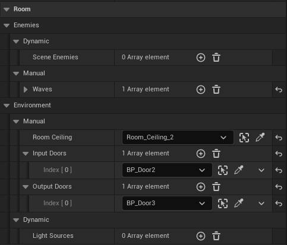
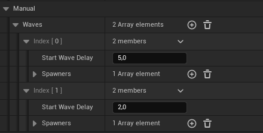

# The Night of Reckoning

> Developed with Unreal Engine 5.3.2

# Настройки для ГД

## Комнаты:

|         |
|:------------------------------:|
| *Примерный вид в окне Details* |

1. Enemies:
   - Dynamic
     - `Scene Enemies` - список врагов, которые находятся на сцене внутри команты. Будут динамически добавлены в список в начале игры. **(*Настройка не требуется*)** 
   - Manual
     - `Waves` - список волн
       - 
       - `Wave` параметры: 
       - - `Start Wave Delay` - задержка перед началом волны волны
       - - `Spawners` - список спавнеров
           - 
           - `Spawner` параметры:
           - - `Enemy Spawner` - ссылка на спавнер, из которого будут выходить враги
           - - `AI Character Class` - пример врага, который бдует спавниться
           - - `Enemies Count` - кол-во врагов
           - - `Start Delay` - задержка перед началом процесса спавна
           - - `Spawn Delay` - задежка спавна
2. Environment
   - Dynamic
     - `Light Sources` - список источников света, которые находятся на сцене внутри команты. Будут динамически добавлены в список в начале игры. **(*Настройка не требуется*)**
   - Manual
     - `Room Ceiling` - ссылка на потолок комнаты
     - `Input Doors` - список входных дверей
     - `Output Doors` - список выходных дверей